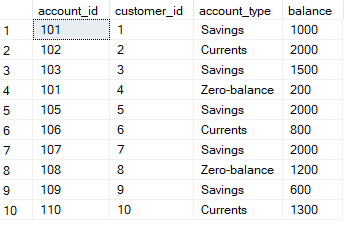

### TABLE 1(Customers)

```sql
CREATE TABLE Customers
(
       [customer_id] Int,
	   [first_name] nvarchar(max),
	   [last_name] nvarchar(max),
	   [DOB] date,
	   [email] nvarchar(max),
	   [phone_number] varchar(max),
	   [address] nvarchar(max)
);
```

### TABLE 2(Accounts)

```sql
CREATE TABLE Accounts
(
       [account_id] Int,
	   [customer_id] Int,
	   [account_type] nvarchar(max),
	   [balance] Int
);
```

### TABLE 3(Transactions)

```sql
CREATE TABLE Transactions
(
       [transaction_id] Int,
	   [account_id] Int,
	   [transaction_type] nvarchar(max),
	   [amount] Int,
	   [transaction_date] date
);
```

### TABLE 4(InterestRates)

```sql
CREATE TABLE InterestRates
(
       [interest_rate_id] Int,
	   [account_type] nvarchar(max),
	   [interest_rate] float
);
```

### TABLE 5(Branches)

```sql
CREATE TABLE Branches
(
       [branch_id] Int,
	   [branch_name] nvarchar(max),
	   [address] nvarchar(max)
);
```

#### SOLUTION - 1

```sql
--(Inserting customer data)
INSERT INTO Customers
VALUES
(1,'John','Doe', '1990-05-15', 'john.doe@gmail.com','123-456-7890','123 Main St,USA'),
(2,'Jane','Smith', '1985-08-20', 'jane.smith@gmail.com','456-789-0123','456 Elm St,UK'),
(3,'Michael','Johnson', '1982-03-10', 'michael.johnson@gmail.com','789-012-3456','789 Oak Ave,USA'),
(4,'Emily','Brown', '1995-11-25', 'emily.brown@gmail.com','234-567-8901','234 Pine Blvd,UK'),
(5,'David','Williams', '1988-09-12', 'david.williams@gmail.com','567-890-1234','567 Cedar Ln,UK'),
(6,'Sarah','Davis', '1992-07-03', 'sarah.davis@gmail.com','890-123-4567','456 Elm St,UK'),
(7,'James','Miller', '1980-04-18', 'james.miller@gmail.com','345-678-9012','345 Birch Rd,USA'),
(8,'Jessica','Garcia', '1993-12-30', 'jessica.garcia@gmail.com','678-901-2345','678 Willow Ave,USA'),
(9,'Daniel','Martin', '1987-06-08', 'daniel.martin@gmail.com','901-234-5678','123 Main St,USA'),
(10,'Jennifer','Lopez', '1984-02-14', 'jennifer.lopez@gmail.com','012-345-6789','012 Oakwood Ln,UK');
```

```sql
SELECT * FROM Customers
```


```sql
--(Inserting accounts data)
INSERT INTO Accounts
VALUES
(101,1,'Savings',1000),
(102,2,'Currents',500),
(103,3,'Savings',1500),
(101,4,'Zero-balance',200),
(105,5,'Savings',2000),
(106,6,'Currents',800),
(107,7,'Savings',2000),
(108,8,'Zero-balance',1200),
(109,9,'Savings',600),
(110,10,'Currents',1300);
```

```sql
SELECT * FROM Accounts
```


```sql
--(Inserting Transactions data)
INSERT INTO Transactions
VALUES
(1001,101,'Deposit',3000,'2023-01-05'),
(1002,102,'Withdrawal',100,'2023-01-10'),
(1003,103,'Deposit',200,'2023-02-02'),
(1001,104,'Deposit',1000,'2023-02-20'),
(1005,105,'Transfer',500,'2023-03-15'),
(1006,106,'Withdrawal',200, '2023-04-01'),
(1007,107,'Transfer',400, '2023-04-10'),
(1008,108,'Deposit',800,'2023-05-05'),
(1009,109,'Withdrawal',200,'2023-05-20'),
(1010,110,'Transfer',300,'2023-06-01');
```

```sql
SELECT * FROM Transactions
```


```sql
--(Inserting InterestRates data)
INSERT INTO InterestRates
VALUES
(111,'Savings',1.50),
(112,'Current',0.25),
(113,'Savings',1.50),
(114,'Zero-balance',1.75),
(115,'Savings',1.50),
(116,'Current',1.85),
(117,'Savings', 1.50),
(118,'Zero-balance',3.25),
(119,'Savings',1.50),
(120,'Currents',2.50);
```

```sql
SELECT * FROM InterestRates
```


```sql
--(Inserting Branches data)
INSERT INTO Branches
VALUES
(1110,'Main Street Branch','789 West Ave, Sunset City'),
(1120,'Downtown Branch','456 East St, Sunrise Town'),
(1130,'Oak Avenue Branch','123 North Blvd, Green Valley'),
(1140,'Pine Boulevard Branch','789 South Rd, Ocean View'),
(1150,'Cedar Lane Branch','456 Central Ave, City Center'),
(1160,'Maple Drive Branch','234 River Ln, Riverside'),
(1170,'Birch Road Branch', '567 Mountain Dr, Hilltop City'),
(1180,'Willow Avenue Branch','890 Lakeview Ave, Lakeside Town'),
(1190,'Spruce Court Branch','345 Harbor Rd, Seaside City'),
(1200,'Oakwood Lane Branch','678 Valley Ct, Valleyview');

```

```sql
SELECT * FROM Branches
```


```sql
SELECT * FROM Customers
SELECT * FROM Accounts
SELECT * FROM Transactions
SELECT * FROM InterestRates
SELECT * FROM Branches
                                     -- Additional commands to view or drop the tables
DROP  TABLE Customers
DROP  TABLE Accounts
DROP  TABLE Transactions
DROP  TABLE InterestRates
DROP  TABLE Branches
```

#### SOLUTION 2

```sql
SELECT concat(first_name,' ',last_name) as Full_Name,account_type,email
from Customers
JOIN Accounts
ON Customers.customer_id=Accounts.customer_id;

```


#### SOLUTION 3

```sql
SELECT Customers.customer_id, concat(first_name,' ',last_name) as Customer_name,transaction_id,transaction_type,amount,transaction_date
from Transactions
JOIN Accounts
ON Transactions.account_id=Accounts.account_id
JOIN Customers
ON Accounts.customer_id=Customers.customer_id;
```


#### SOLUTION 4

```sql
-- To increase the balance of account with account_id = 102 by 1500

UPDATE Accounts
SET balance=balance+1500
where account_id=102;    -- In the below output the amount for the account_id 102 got updated.
```


#### SOLUTION 5

```sql
-- To combine both first and last names we can use concat function
SELECT concat(first_name,' ',last_name) as full_name from Customers
```


#### SOLUTION 6

```sql
DELETE FROM Accounts
where balance=0 AND account_type='Savings'  --No account is deleted since there is no savings account with zero balance and that got updated in the below table
```



#### SOLUTION 7

```sql
-- Here there is no separate city column so filtered from the address column itself
SELECT  concat(first_name,' ',last_name) as Customer_name ,"address"
from Customers
where "address" like '%USA%';
```


#### SOLUTION 8

```sql
SELECT account_id,balance
from Accounts
where account_id=102; --specific account
```


#### SOLUTION 9

```sql
SELECT Accounts.account_id,balance,InterestRates.interest_rate,round(balance*(interest_rate/100),2) as interest_accrued
FROM Accounts
JOIN InterestRates
ON Accounts.account_type=InterestRates.account_type
where Accounts.account_type='Savings'
;
```


#### SOLUTION 10

```sql
SELECT avg(balance) as AvgBalance from Accounts
JOIN Customers
ON Accounts.customer_id=Customers.customer_id
GROUP BY Customers.customer_id,Customers.first_name;
```


#### Solution 11

```sql
SELECT a.account_id, avg(a.balance) as avg_dailybal
FROM Accounts a
JOIN Transactions t
ON a.account_id=t.account_id
where t.transaction_date between '2023-01-05' and '2023-06-01'
GROUP BY  a.account_id;
```


#### SOLUTION 12

```sql
SELECT Account_id, Count(transaction_id) as num_trans
from Transactions
GROUP BY account_id
ORDER BY num_trans DESC;
```


#### SOLUTION 13

```sql
SELECT first_name, Accounts.account_type,sum(accounts.balance) as aggregate_bal
from Customers
JOIN Accounts
ON Customers.customer_id=Accounts.customer_id
GROUP BY Customers.customer_id, Customers.first_name,Accounts.account_type;
```


#### SOLUTION 14

```sql
SELECT Count(*) as duplicates FROM Transactions
JOIN Accounts
ON Transactions.account_id=Accounts.account_id
GROUP BY Accounts.account_type,Transactions.amount,Transactions.transaction_date
having Count(*) > 1;   --Since there are no duplicate transactions in the record nothing is displayed in the output record
```


#### SOLUTION 15

```sql
SELECT
    a.account_type,
    (SELECT SUM(b.balance)
	 FROM Accounts b
	 WHERE b.account_type = a.account_type)
	 AS total_balance
FROM
    (SELECT DISTINCT account_type FROM Accounts) a;
```


